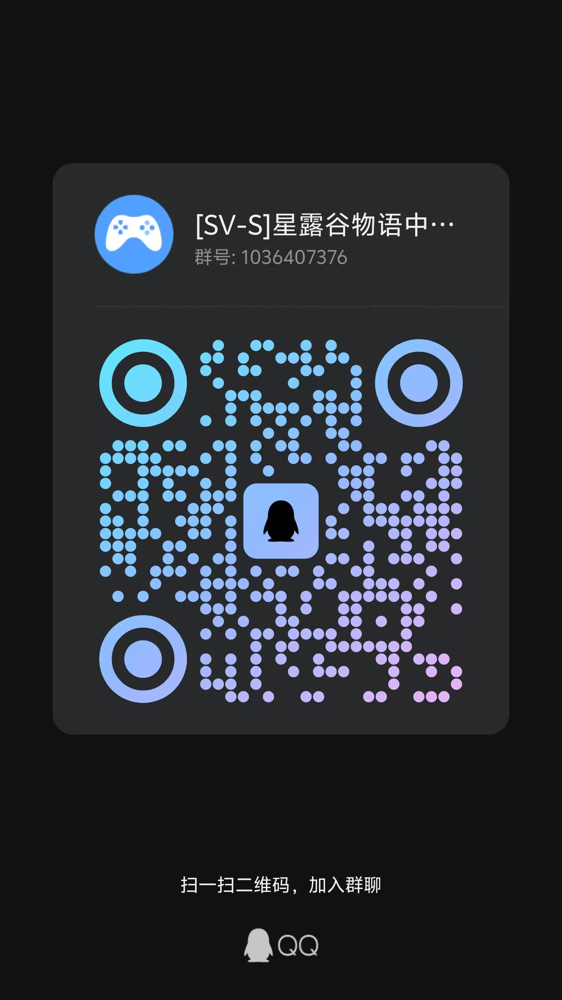
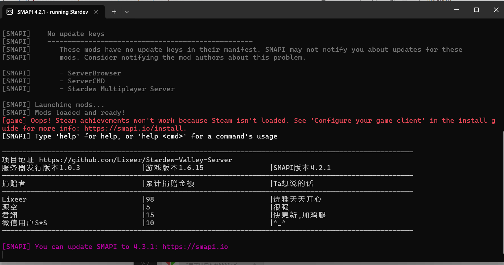

# Stardew-Valley-Server
星露谷多人游戏服务器解决方案/An ingenious solution about game Stardew Valley Multiplayer


[简体中文](README.md)|[English](README_en.md)

***
## 🚩开始之前
1.如果您从来没有这方面的经验，那么我们推荐你在下方链接购买服务器，并由专业人员为你服务，而不是在群里谴责群主 [高性价比服务器推荐](https://m.tb.cn/h.TxeOlTH?tk=3w1SeNmrOKB) ，在这里购买服务器后他会为你安排好一切

2.项目在线体验服务器(游戏版本1.6.15,ip直连):160.202.233.247
## 🌻快速开始
> 视频教程：[bilibili【星露谷物语开服/多人游戏服务器/三端互通/远程联机】]( https://www.bilibili.com/video/BV13VPJe6EM1/?share_source=copy_web&vd_source=dddc5d0c3c33183e95f30f7d1ccdb295)

1.[下载发行包](docs/start/release-page_zh.md)如果需要提取码请加入下方QQ群获取(凭借star截图礼貌获取,我们是免费的,但不是屈尊的)

2.解压发行包

3.运行发行包目录下的`run.ps1`文件

4.根据提示继续

5.如遇以下提示，请输入数字键`1`并回车
```
Please make a deployment choice:
1. Core desktop OpenGL drivers
3. Install DirectX IL for redistribution only
7. Update system-wide deployment
8. Remove system-wide deployments (uninstall)
9. Exit
```
6.而后输入数字键`9`，退出

7.等待游戏启动以及图形化界面出现

8.选择多人合作，选择心仪的游戏模式地图等等，请记住，一定要开放多人游戏位置

9.进入游戏后按f9即可进入自动模式（自动模式下，机器人会响应游戏事件并确认，且机器人将在每晚8点睡觉）

## ✨优势
1.无需gpu，可以在大部分vps服务器中使用

2.无需steam登录验证,andriod，ios，pc，三端互通

3.支持mod，理论上只要配置够以及mod兼容性够好(指的是客机和主机的smapi版本不同的情况下，mod的稳定情况)，可以安装任何mod

4.相较容易上手，并且是星露谷中文社区的较为优雅的解决方案，不会面临docker，Linux运维问题

5.自建服务器(如果你没有服务器维护经验，或者说你不知道服务器是什么，请看上面服务器推荐一栏)，更为稳定且数据更安全

## 😘社区
### 🐧QQ群

[1群1036407376(已满)](https://qm.qq.com/q/Q8QaovnQWG)  
[2群1020152532](https://qm.qq.com/q/KhXvEqsw8g)  
[qq频道(版本发布信息)](https://pd.qq.com/s/7gut1do04?b=5)    



## 💰Donte
`每一笔5RMB以上的donte都会发布到广告页，每当有一个StardewValley server被运行的时候捐赠者都会被鸣谢`



